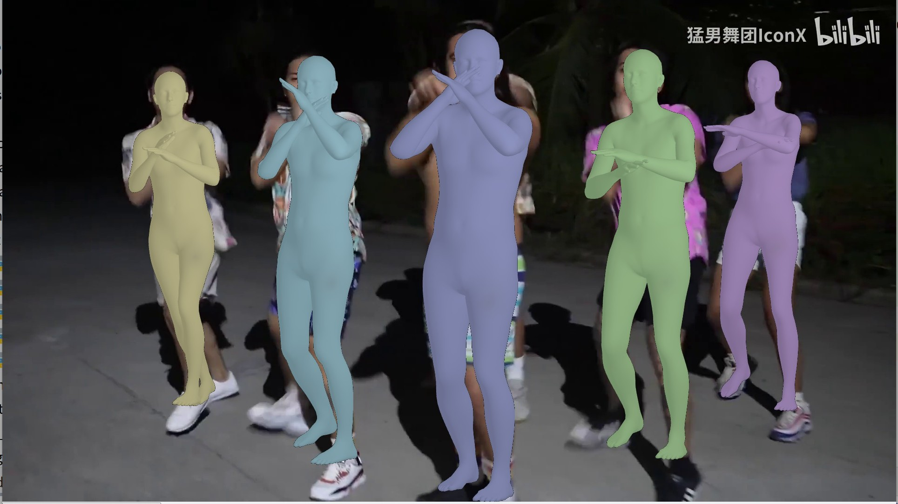

# Real-time VIBE
#### Inference VIBE frame-by-frame. 

<p float="center">
  
</p>


# Overview
This is a **frame-by-frame** inference fork of VIBE at [https://github.com/mkocabas/VIBE]. 

Usage:

```python
import cv2
from vibe.rt.rt_vibe import RtVibe

rt_vibe = RtVibe()
cap = cv2.VideoCapture('sample_video.mp4')
while cap.isOpened():
    ret, frame = cap.read()
    rt_vibe(frame)  # This will open a cv2 window
```

SMPL Render takes most of the time, which can be closed with `vibe_live.render = False`

# Getting Started
Installation:
```bash
# conda must be installed first
wget https://github.com/zc402/RT-VIBE/releases/download/v1.0.0/RT-VIBE.tar.gz
tar zxf RT-VIBE.tar.gz
cd RT-VIBE
# This will create a new conda env called vibe_env
source scripts/install_conda.sh
pip install .  # Install rt-vibe
```

Run on sample video:
```bash
python rt_demo.py  # (This runs sample_video.mp4)
# or
python rt_demo.py --vid_file=multiperson.mp4
```

Run on camera:
```bash
python rt_demo.py --camera
```

# Try with google colab

This notebook provides video and camera inference example. 

(there are some dependency errors during pip install, which is safe to ignore. Remember to restart environment after installing `pytorch`.)

https://colab.research.google.com/drive/1VKXGTfwIYT-ltbbEjhCpEczGpksb8I7o?usp=sharing

# Features
- [x] Make VIBE an installable package
- [x] Fix **GRU hidden states lost between batches** in demo.py
- [x] Add **realtime interface** which processes the video stream frame-by-frame
- [x] Decrease GPU memory usage

# Explain
1. ### Pip installable. 

- This repo renames "lib" to "vibe" ("lib" is not a feasible package name), corrects corresponding imports, adds `__init__.py` files. It can be installed with:
```
pip install git+https://github.com/zc402/RT-VIBE
```

2. ### GRU hidden state lost:

- The original vibe.py **reset** GRU memory for each batch, which causes discontinuous predictions.

- The GRU hidden state is `reset` at:
```
# .../models/vibe.py
# class TemporalEncoder
# def forward()
y, _ = self.gru(x)

# The "_" is the final hidden state and should be preserved
# https://pytorch.org/docs/stable/generated/torch.nn.GRU.html
```

- This repo preserve GRU hidden state within the **lifecycle of the model**, instead of one batch.

```
# Fix:

# __init__()
self.gru_final_hidden = None

# forward()
y, self.gru_final_hidden = self.gru(x, self.gru_final_hidden)
```

3. ### Real-time interface

- This feature makes VIBE run on webcam.

- Processing steps of the original VIBE :
  - use ffmpeg to **split video** into images, save to /tmp 
  - process the human **tracking** for whole video, keep results in memory
  - predict smpl params with VIBE for whole video, 1 person at a time.
  - (optional) render and show (frame by frame)
  - save rendered result

- Processing steps of **realtime interface**
  - create VIBE model.
  - read a frame with cv2
  - run tracking for 1 frame
  - predict smpl params for each person, keep the hidden states separately.
  - (optional) render and show
- **Changes**
  - Multi-person-tracker is modified to receive image instead of image folder.
  - a dataset wrapper is added to convert single image into a pytorch dataset.
  - a `rt_demo.py` is added to demonstrate the usage.
  - ImageFolder dataset is modified
  - ImgInference dataset is modified
  - requirements are modified to freeze current tracker version. (Class in my repo inherits the tracker and changes its behavior)

4. ### Decrease inference memory usage
- The default batch_size in demo.py needs `~10GB` GPU memory
- Original demo.py needs large vibe_batch_size to keep GRU hidden states
- Since the GRU hidden state was fixed now, lowering the memory usage won't harm the accuracy anymore.
- With the default setting in this repo, inference occupies `~1.3GB` memory, which makes it runable on low-end GPU.
- This will slow down the inference a little. The current setting (batchsize==1) reflect actual realtime processing speed.
```
# Large batch causes OOM in low-end memory card
tracker_batch_size = 12 -> 1
vibe_batch_size = 450 -> 1
```

# Other fixes

Remove `seqlen`. The seqlen in demo.py has no usage (GRU sequence length is decided in runtime and equals to batch_size). With the fix in this repo, it is safe to set batch_size to 1.
